# Phygital Master Map — Greater Good Temple Society

**Version:** 1.0
**Date:** April 4, 2026

Single integrated diagram of the Greater Good Temple Society phygital sovereignty system. Shows land parcels, NFTs, Freedom Grid nodes, Stevie AI workflow, DAO integration, Street Credit, Freedom Notes, and Trust legal layer — all connected end-to-end.

```mermaid
graph TD
    subgraph "PHYSICAL LAYER — LAND (Mid-Atlantic Dynasty Trust)"
        A1[Parcel A1 - Core Hub
2 acres - Residential + Servers]
        A2[Parcel A2 - Education Zone
1.5 acres - Krafty Academy]
        B1[Parcel B1 - Healing Gardens
3 acres - Community Programs]
        B2[Parcel B2 - Infrastructure
0.5 acres - Grid Equipment]
        C1[Parcel C1 - Expansion
5 acres - Future Development]
    end

    subgraph "DIGITAL ACCESS LAYER"
        NFT1[BlackCoins NFT - Steward Tier
Links to A1]
        NFT2[BlackCoins NFT - Member Tier
Links to A2/B1]
        NFT3[BlackCoins NFT - Founder Tier
Links to C1]
    end

    subgraph "FREEDOM GRID INFRASTRUCTURE"
        FG[Freedom Grid Nodes
Mesh Network + Renewable Energy
Wi-Fi / VPN / Servers]
    end

    subgraph "IDENTITY & MERIT LAYER"
        SBT[Soul-Bound Ministry ID
Street Credit Ledger]
    end

    subgraph "AI ORCHESTRATION LAYER"
        Stevie[Stevie AI
Access Validation
Activity Logging
Reward Issuance
Violation Enforcement
Blockchain Hashing]
    end

    subgraph "ECONOMIC LAYER"
        FN[Freedom Notes
Internal Accounting Units of Effort]
    end

    subgraph "GOVERNANCE LAYER"
        DAO[Hip-Hop People's DAO
Governance Voting
Treasury Management]
        PMA[PMA Rules
Membership Compliance
Dispute Resolution]
    end

    subgraph "LEGAL BACKSTOP"
        Trust[Mid-Atlantic Dynasty Trust
Legal Title + License Backing]
    end

    %% Connections
    A1 & A2 & B1 & B2 & C1 -->|Physical Land| FG
    FG -->|Powers + Connects| Stevie
    NFT1 & NFT2 & NFT3 -->|Grants Licensed Access| A1 & A2 & B1 & B2 & C1
    SBT -->|Verifies Member| Stevie
    Stevie -->|Validates & Logs| FN
    Stevie -->|Enforces Rules| PMA
    FN -->|Circulates Internally| DAO
    DAO -->|Governs| Trust
    Trust -->|Holds Title| A1 & A2 & B1 & B2 & C1

    %% Styling
    classDef physical fill:#0D1017,stroke:#C9A84C,stroke-width:2px
    classDef digital fill:#111820,stroke:#4A7BF7,stroke-width:2px
    classDef ai fill:#1A2030,stroke:#34D399,stroke-width:2px
    class A1,A2,B1,B2,C1,FG physical
    class NFT1,NFT2,NFT3,SBT,FN digital
    class Stevie,DAO,PMA ai
    class Trust physical
```

## How to Read This Diagram

The full loop: **Land → NFT Access → Freedom Grid → Stevie AI → Street Credit → Freedom Notes → DAO Governance → Trust Legal Backstop**

- **Physical Layer**: McCaskey Road parcels held by Mid-Atlantic Dynasty Trust
- **Digital Access Layer**: BlackCoins NFTs grant licensed (not ownership) access to land zones
- **Freedom Grid**: Mesh network + renewable energy infrastructure powering the physical nodes
- **Identity & Merit**: Soul-Bound Ministry IDs carry each member's Street Credit ledger
- **Stevie AI**: Autonomous orchestrator — validates access, logs activity, issues rewards, enforces violations
- **Freedom Notes**: Internal accounting units issued for verified participation
- **DAO / PMA**: Governance and rule enforcement layer
- **Trust**: Legal backstop holding title to all physical assets
